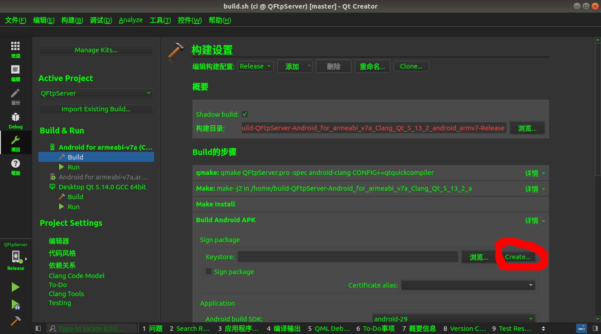
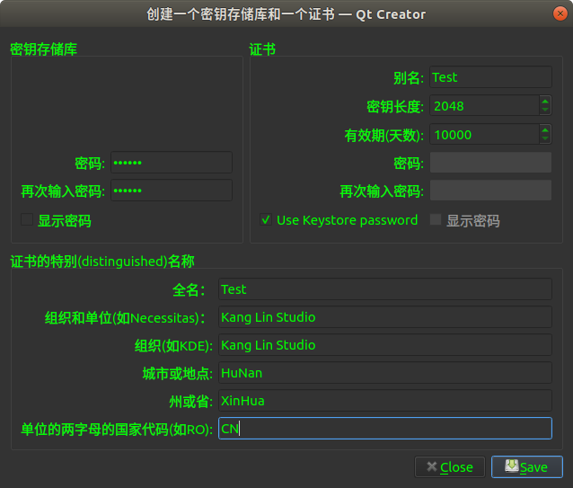
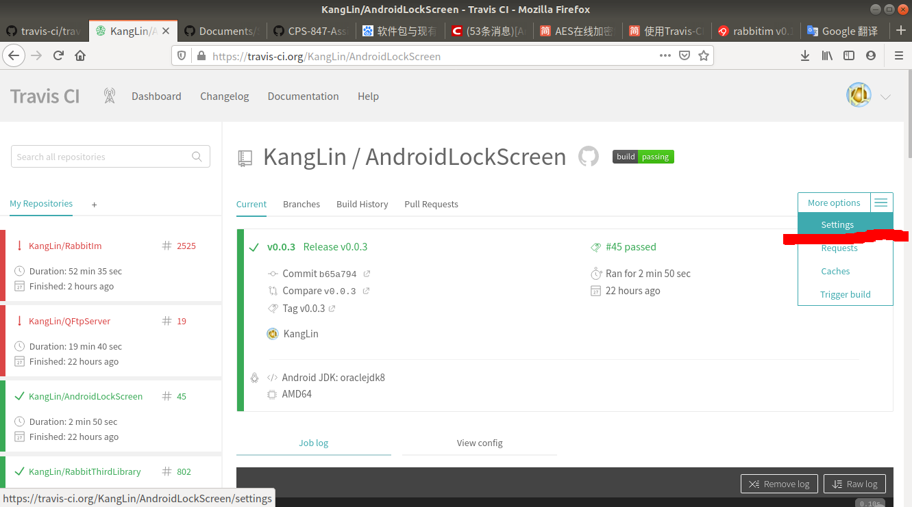

# Android 签名
作者：康林(kl222@126.com)

---------------------------------------------

- [返回主目录](../README.md)
- [命名行签名](#命名行签名)
- [Android studio 签名](#Android-studio-签名)
- [QtCreator 签名](#QtCreator-签名)
- [CI 签名](#CI-签名)

---------------------------------------------

### 命令行签名
签名工具是jdk提供。所以在执行下列命令前需要先安装jdk。并设置：

    export PATH=$JAVA_HOME/bin:$PATH

1. 生成密钥库(key store)文件

        l@l-Lenovo:/home/RabbitCommon$ keytool -genkey -alias RabbitCommon -keyalg RSA -validity 36500 -keystore RabbitCommon.keystore
        输入密钥库口令:  
        输入密钥库口令:  
        再次输入新口令: 
        您的名字与姓氏是什么?
          [Unknown]:  KangLin
        您的组织单位名称是什么?
          [Unknown]:  Kang Lin Studio
        您的组织名称是什么?
          [Unknown]:  Kang Lin Studio
        您所在的城市或区域名称是什么?
          [Unknown]:  XinHua
        您所在的省/市/自治区名称是什么?
          [Unknown]:  HuNan
        该单位的双字母国家/地区代码是什么?
          [Unknown]:  CN
        CN=KangLin, OU=Kang Lin Studio, O=Kang Lin Studio, L=XinHua, ST=HuNam, C=CN是否正确?
        [否]:  y

    创建一个证书文件，名为 RabbitCommon.keystore，别名也为 RabbitCommon.keystore ，加密算法采用 RSA，有效期为 100年。  
    注：
    - genkey 生成文件
    - alias 别名
    - keyalg 加密算法
    - validity 有效期
    - keystore 文件名

2. 查看密钥库(key store)文件信息

        keytool -list -v -keystore

3. 编译发布(Release)模式下您的应用程序，以获得一个无符号的APK

4. 签名

        jarsigner -verbose -sigalg SHA1withRSA -digestalg SHA1 -keystore RabbitCommon.keystore my_application.apk RabbitCommon

5. 验证你的apk签名：

        jarsigner -verify -verbose -certs my_application.apk

6. 使用zipalign来对齐apk包：

        zipalign -v 4 your_project_name-unaligned.apk your_project_name.apk

   zipalign 确保所有的未压缩数据与特定字节对齐相对于文件，从而降低apk文件的大小。

7. 参考

- [Android中签名、证书、公钥密钥的概念及使用](https://blog.csdn.net/u011974987/article/details/52415037)

### Android studio 签名

- 参考

- [为您的应用签名](https://developer.android.google.cn/studio/publish/app-signing.html)

### QtCreator 签名
- 构建设置 -> Build android apk -> Create

- 建立密钥库(key store)文件

- 原理  
QtCreator 签名是通过 androiddeployqt 来进行的。

        l@l-Lenovo:/opt/Qt5.13.2/5.13.2/android_x86/bin$ ./androiddeployqt --help
        Optional arguments:
        　--sign <url/to/keystore> <alias>: Signs the package with the
            specified keystore, alias and store password. Also implies the
          --release option.
        Optional arguments for use with signing:
          --storepass <password>: Keystore password.
          --storetype <type>: Keystore type.
          --keypass <password>: Password for private key (if different
            from keystore password.)
          --sigfile <file>: Name of .SF/.DSA file.
          --digestalg <name>: Name of digest algorithm. Default is
            "SHA1".
          --sigalg <name>: Name of signature algorithm. Default is
            "SHA1withRSA".
          --tsa <url>: Location of the Time Stamping Authority.
          --tsacert <alias>: Public key certificate for TSA.
          --internalsf: Include the .SF file inside the signature block.
          --sectionsonly: Don't compute hash of entire manifest.
          --protected: Keystore has protected authentication path.
          --jarsigner: Force jarsigner usage, otherwise apksigner will be
            used if available.

        l@l-Lenovo:/opt/Qt5.13.2/5.13.2/android_x86/bin$ ./androiddeployqt \
            --input ${SOURCE_DIR}/App/android-libRabbitCommonApp.so-deployment-settings.json \
            --output ${SOURCE_DIR}/android-build \
            --android-platform ${ANDROID_API} \
            --gradle \
            --sign RabbitCommon.keystore rabbitcommon \
            --storepass ${STOREPASS}

### CI 签名
CI是自动化构建系统，需要密钥库(key store)文件和相关密码，如果用明码，没安全性可言。所以需要对密钥库(key store)文件和相关密码加密。

- 加密密钥库(key store)文件
虽然密钥库(key store)有密码保护，但是比较弱。所以一般不直接把密钥库(key store)文件放到源码树中，只把加密后的密钥库(key store)文件放到源码树中。一般用openssl来加密。
  + 直接用openssl。

        openssl help aes-256-cbc #查看加密与解密用法

        openssl aes-256-cbc -K $KEY -iv $IV -in RabbitCommon.keystore -out RabbitCommon.keystore.enc -e

  + 通过[travis客户端工具](https://github.com/travis-ci/travis.rb)。它实际也是通过 openssl 来进行加密的。

        travis encrypt-file RabbitCommon.keystore --add

     注意: travis encrypt-file 默认随机产生KEY和IV。如果要加密多个文件，请加参数 -p,显示随机产生的KEY和IV。然后用这个KEY和IV继续加密码后续文件。

        travis encrypt-file RabbitCommon.keystore --add -p
        travis encrypt-file SecondFile.keystore --add --key [上面打印出来的key] --iv [上面打印出来的iv]

- 解密密钥库(key store)文件

    openssl aes-256-cbc -K $KEY -iv $IV -in RabbitCommon.keystore.enc -out RabbitCommon.keystore -d

- 加密密码，密码一般放到环境变量中，然后加密
  + travis
　　- 通过web配置
  　  + 打开设置

　　　

      + 然后添加环境变量。**注意**: DISPLAY VALUE IN BUILD LOG 要设置为关闭
　　- 通过travis客户端

           travis encrypt KEY=keypassword --add
           travis encrypt IV=keyiv --add

  + appveyor  
    通过 https://ci.appveyor.com/tools/encrypt 加密变量，然后再加到 appveyor 文件中

