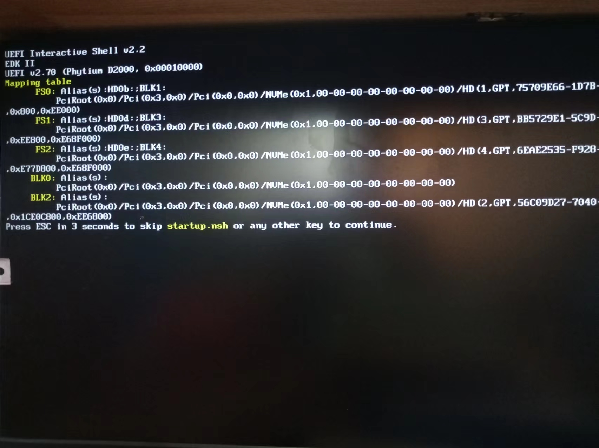

# 安装 arm64

作者：康林 <kl222@126.com>

## 机器配置

- [主板信息](image/mainboard.jpg)
- [启动信息](image/startup.jpg)

```bash
l@debian-lyj:/lib/modules/6.1.0-21-arm64/kernel/drivers$ lspci
00:00.0 PCI bridge: Cadence Design Systems, Inc. Device dc16
00:01.0 PCI bridge: Cadence Design Systems, Inc. Device dc08
00:02.0 PCI bridge: Cadence Design Systems, Inc. Device dc01
00:03.0 PCI bridge: Cadence Design Systems, Inc. Device dc16
00:04.0 PCI bridge: Cadence Design Systems, Inc. Device dc08
00:05.0 PCI bridge: Cadence Design Systems, Inc. Device dc01
01:00.0 VGA compatible controller: Jingjia Microelectronics Co Ltd JM7200 Series GPU (rev 01)
04:00.0 Non-Volatile memory controller: Silicon Motion, Inc. SM2263EN/SM2263XT SSD Controller (rev 03)
06:00.0 PCI bridge: ASMedia Technology Inc. ASM1184e 4-Port PCIe x1 Gen2 Packet Switch
07:01.0 PCI bridge: ASMedia Technology Inc. ASM1184e 4-Port PCIe x1 Gen2 Packet Switch
07:03.0 PCI bridge: ASMedia Technology Inc. ASM1184e 4-Port PCIe x1 Gen2 Packet Switch
07:05.0 PCI bridge: ASMedia Technology Inc. ASM1184e 4-Port PCIe x1 Gen2 Packet Switch
07:07.0 PCI bridge: ASMedia Technology Inc. ASM1184e 4-Port PCIe x1 Gen2 Packet Switch
08:00.0 SATA controller: ASMedia Technology Inc. ASM1062 Serial ATA Controller (rev 02)
09:00.0 USB controller: Renesas Technology Corp. uPD720201 USB 3.0 Host Controller (rev 03)
0a:00.0 Ethernet controller: Realtek Semiconductor Co., Ltd. RTL8111/8168/8411 PCI Express Gigabit Ethernet Controller (rev 11)
0b:00.0 USB controller: Renesas Technology Corp. uPD720201 USB 3.0 Host Controller (rev 03)
```

## 下载 debian

当前版本是: 12.5.0

- https://www.debian.org/CD/

- 下载 arm64 版本
  - [当前版本](https://cdimage.debian.org/cdimage/release/current/arm64/iso-dvd/debian-12.5.0-arm64-DVD-1.iso)
  - [debian-12.5.0-arm64-DVD-1.iso](https://cdimage.debian.org/cdimage/release/12.5.0/arm64/iso-dvd/debian-12.5.0-arm64-DVD-1.iso)

## 制作启动 U 盘

使用 [Ventoy](https://github.com/ventoy/Ventoy) （ 支持 Windows、Linux）制作启动 U 盘。

## 设置 BIOS 启动顺序

把 U 盘做为第一启动。

## 安装 debian 

这里和 x86 系统安装一样。

## 安装完成后的异常处理

如果安装完成后能正常启动，则忽略。

- UEFI 不能正常引导操作系统。它会进入 UEFI shell
  


这里会列出映射表（Mapping table）。例如：加载的硬盘。

在这里 NVME SSD 是以前缀 FS 开头的。

  - 正常引导
  
    因为 EFI 下没有安装引导目录(boot)和引导文件(bootaa64.efi)，引导文件在 debian/shimaa64.efi。所以我们把 shimaa64.efi 重命名 bootaa64.efi 复制到 \EFI\boot\

        ```bash
        FS0:\> ls EFI\debian
        BOOTAA64.CSV  fbaa64.efi  grubaa64.efi	grub.cfg  mmaa64.efi  shimaa64.efi

        FS0:\> mkdir EFI\boot
        FS0:\> cp \EFI\debian\* \EFI\boot
        FS0:\> cp \EFI\debian\shimaa64.efi \EFI\boot\bootaa64.efi
        ```
        
  - 使用 UEFI shell 引导
  
        ```bash
        Shell> FS0:
        FS0:\> ls EFI
        debian
        
        FS0:\> edit startup.nsh ;进入编辑状态
        ```

	输入：
	FS0:EFI\debian\shimaa64.efi
	摁组合键 ctrl+q 后，提示保存，摁回车，再摁组合键 ctrl+q 后退出。
	输入 exit 继续引导，或输入 reset 重启计算机。

- 参考
  - [Debian 的安装（ARM64）](https://my.oschina.net/chipo/blog/5276817)
  - [UEFI 主板手动设置硬盘的引导启动](https://my.oschina.net/chipo/blog/10021751)

