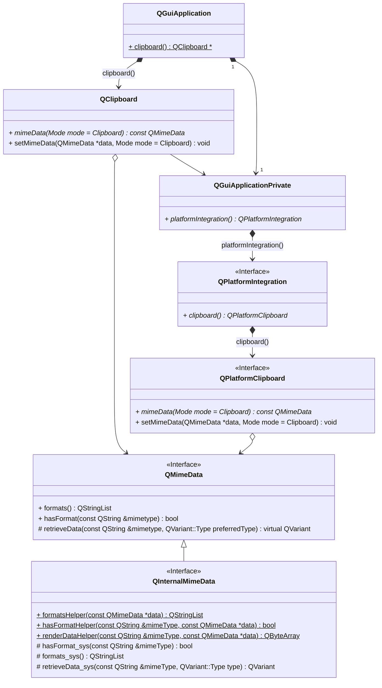
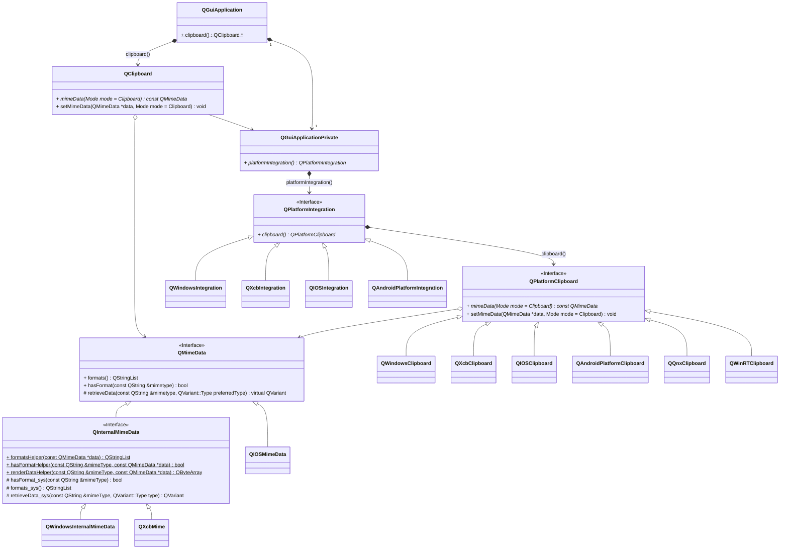
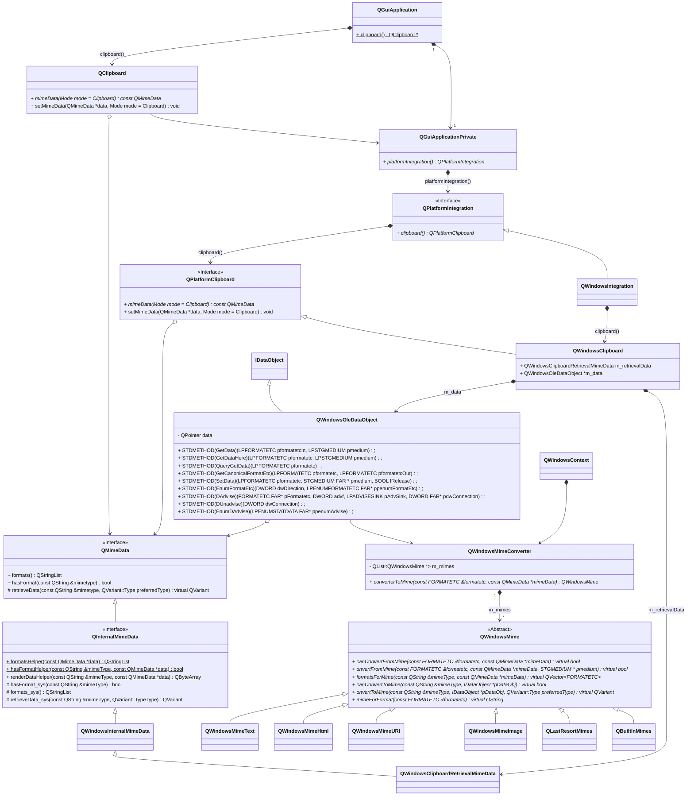

# Qt 剪切板

作者：康林<kl222@126.com>

---------------------------

以下 Qt 源代码版本是：Qt5.12.12

### 剪切板接口类关系：

- 外部接口
  - 类 QClipboard 是剪切板的 API
  - 类 QMimeData 是剪切板数据的 API 
- Qt 内部接口
  - 类 QPlatformClipboard 是 Qt 内部的剪切板接口
  - 类 QInternalMimeData 是 Qt 内部的剪切板数据的接口
 

### 各平台接口类：

### 剪切板 Windows 平台类关系：

- QWindowsMimeText: 处理文本格式("text/plain"、CF_UNICODETEXT、CF_TEXT)
- QWindowsMimeHtml: 处理 "HTML Format" 格式
- QWindowsMimeURI：处理URL("CF_HDROP"、"UniformResourceLocatorW"、"UniformResourceLocator")
- QWindowsMimeImage: 处理图片(CF_DIB、CF_DIBV5、"PNG")
- QBuiltInMimes：处理Qt内部格式（"application/x-color"）
- **QLastResortMimes**：处理除了上面特定格式外的格式。 根据 QMimeData 中的格式在剪切板中注册相应的格式。
例如："FileGroupDescriptorW"（CFSTR_FILEDESCRIPTOR）、”FileContents"（CFSTR_FILECONTENTS）

