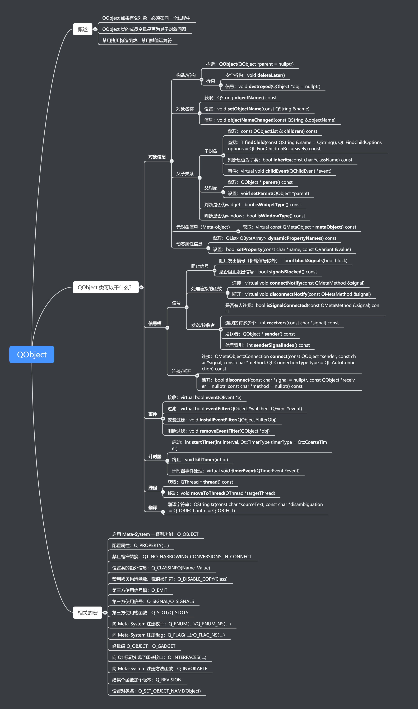

# Qt

作者：康林 <kl222@126.com>
-------------------------

- [QObject](#QObject)
- [获得 qt 二进制执行程序](#获得-qt-二进制执行程序)
- [qt install](#qt-install)
- [qt 插件](#qt-插件)
- [开源qt第三方库](qt_third.md)
- [qt 本地化](#qt-本地化)
- [qt 资源](resource.md)
- [qt 工具](#qt-工具)
- [qt 主题](theme.md)

### QObject

### 获得 qt 二进制执行程序
- 系统自带的
  + ubuntu
    - 基本的

        sudo apt-get install qttools5-dev qttools5-dev-tools \
             qtbase5-dev qtbase5-dev-tools

    - 模块
      + libqt5serialport5-dev 
      + qtmultimedia5-dev
      + qtwebengine5-dev
      + libqt5webkit5-dev
      + qtdeclarative5-dev
      + qtlocation5-dev
      + qtpositioning5-dev
      + qtpim5-dev
      + qtquickcontrols2-5-dev
      + qtscript5-dev
      + libqt5texttospeech5-dev
      + libqt5webchannel5-dev
  + [launchpad](https://launchpad.net/~beineri)
- [qt官网](http://download.qt.io/official_releases/qt/)
  + qt 在线安装。用国内镜像:
    - 配置方法: http://mirrors.ustc.edu.cn/help/qtproject.html

      从 https://mirrors.aliyun.com/qt/official_releases/online_installers/ 下载在线安装器。

    - 可以使用以下两种方式之一在安装器中配置使用阿里云源下载 Qt：

      +（推荐）新版本的安装器（4.0.1-1 后）支持 --mirror 命令行参数。在命令行中执行安装器，添加 --mirror https://mirrors.aliyun.com/qt 参数。例如 Windows 下执行当前目录的安装器的命令为 .\qt-unified-windows-x86-online.exe --mirror https://mirrors.aliyun.com/qt；

      + 或在启动安装器后在设置中禁用默认源，添加新源 https://mirrors.aliyun.com/qt/online/qtsdkrepository/linux_x64/root/qt/ （其他版本注意更改地址）。
  + 国内镜像：
    - 中国科学技术大学：http://mirrors.ustc.edu.cn/qtproject/
    - 清华大学：https://mirrors.tuna.tsinghua.edu.cn/qt/
    - 北京理工大学：http://mirror.bit.edu.cn/qtproject/
    - 腾讯： https://mirrors.cloud.tencent.com/qt/
    - 阿里： https://mirrors.aliyun.com/qt/

### qt install
- 应用默认安装前缀。
  + qnx 安装到 /tmp 
  + android 安装到 / 
  + 其它安装到编译目录下的 install 目录下
- 启动 desktop 文件。安装到 /usr/share/applications/ 目录下
- 启动图标。安装到 /usr/share/pixmaps 目录下
- 例如：
  + qmake

        isEmpty(PREFIX) : !isEmpty(INSTALL_ROOT) : PREFIX=$$INSTALL_ROOT
        isEmpty(PREFIX) {
            qnx : PREFIX = /tmp
            else : android : PREFIX = /.
            else : PREFIX = $$OUT_PWD/install
        }
        
        !android : !macx : unix {
            # install icons
            icon128.target = icon128
            icon128.files = App/Resource/png/SerialPortAssistant.png
            icon128.path = $${PREFIX}/share/pixmaps
            icon128.CONFIG = directory no_check_exist
        
            # install desktop file
            DESKTOP_FILE.target = DESKTOP_FILE
            DESKTOP_FILE.files = $$PWD/debian/SerialPortAssistant.desktop
            DESKTOP_FILE.path = $$system_path($${PREFIX})/share/applications
            DESKTOP_FILE.CONFIG += directory no_check_exist
            INSTALLS += DESKTOP_FILE icon128
        }

### qt 在　android　启动时白屏

	#if (QT_VERSION > QT_VERSION_CHECK(5,6,0))
	    QApplication::setAttribute(Qt::AA_EnableHighDpiScaling);
	#endif

	android启动时透明

	#if defined(Q_OS_ANDROID) && QT_VERSION >= QT_VERSION_CHECK(5, 7, 0)
	    QtAndroid::hideSplashScreen();
	#endif

### qt 插件

qt 插件分为高层插件与低层插件。

- 高层插件是由Qt已经定义好接口的插件。用户只需要实现接口就可以了。
- 低层插件是由用户自己定义接口并实现。

#### qt低层插件
- 插件扩展应用程序
  1. 定义接口
  2. 用宏 Q_DECLARE_INTERFACE() 向qt元对象系统声明接口
  3. 在应用程序中用 QPluginLoader 加载插件
  4. 用 qobject_cast() 测试插件是否是指定接口的实现。并返回接口实例

- 实现一个插件
  1. 从 QObject 和接口继承声明一个插件类
  2. 用 Q_INTERFACES() 向qt元对象系统声明接口
  3. 用 Q_PLUGIN_METADATA() 宏导出插件
  4. 用 pro 文件或 CMake 建立子项目

### qt 本地化

- 在代码中使用 QObject::tr() 函数来得到本地化的翻译字符。
- 语言工具(LinguistTools)，它已集成到了QtCreator中，菜单->工具->外部->qt语言家
  - [必须] lupdate: 用于产生和更新翻译源文件(.ts)。
    + 它可以从给定的 pro 文件中产生或更新翻译源文件。pro 文件中用 TRANSLATIONS 指定本翻译源文件(.ts)

        TRANSLATIONS = arrowpad_zh_CN.ts \
                 arrowpad_nl.ts

        执行 lupdate 命令：

        lupdate myproject.pro

    + 直接从源码文件中产生或更新翻译源文件。

        lupdate qml.qrc filevalidator.cpp -ts myapp_en.ts myapp_fr.ts

  - [可选] Qt Linguist 或其它文本编辑工具，修改翻译源文件(.ts)中的翻译
  - [必须] lrelease: 用于从翻译源文件(.ts)产生翻译文件(.qm)

        lrelease.exe main_en.ts languages\main_fr.ts

- 使用翻译文件(.qm)
  + 以普通文件方式：在代码中开始时，使用 QCoreApplication::installTranslator 安装翻译文件(.qm)。
可以安装多个翻译文件(.qm)。将以与安装相反的顺序搜索翻译，因此，将首先搜索最近安装的翻译文件(.qm)，最后搜索安装的第一个翻译文件(.qm)。一旦找到包含匹配字符串的翻译，搜索就会停止。

        QTranslator zh;
        zh.load(RabbitCommon::CDir::Instance()->GetDirTranslations()
              + "/RabbitCommonApp_" + QLocale::system().name() + ".qm");
        qApp->installTranslator(&zh);

  + 以资源文件方式
    - 添加翻译文件(.qm)到资源文件中。最好是单独建立一个资源文件。

        RESOURCES += translations_RabbitCommonApp.qrc

    - 使用 Q_INIT_RESOURCE 初化资源文件

        Q_INIT_RESOURCE(translations_RabbitCommonApp);

    - 从资源中安装翻译文件(.qm)

        QTranslator zh;
        zh.load(":/RabbitCommonApp_" + QLocale::system().name() + ".qm");
        qApp->installTranslator(&zh);

- 在代码中结束时，要使用 QCoreApplication::removeTranslator 卸载翻译文件(.qm)

        qApp->removeTranslator(&zh);

- [参考：qt 资源](resource.md)

### qt 工具

- qss:
  + QssStylesheetEditor: https://github.com/hustlei/QssStylesheetEditor
  + qsseditor: https://github.com/smoked-herring/qsseditor
  + qui-creator: https://github.com/jhonconal/QUI-Creator
