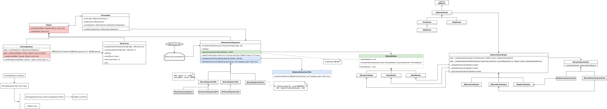
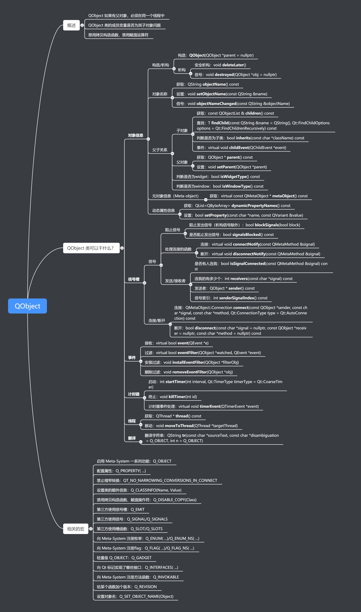

# Qt 事件

作者：康林 <kl222@126.com>

## 关系图

## 事件
### 使用事件

#### 使用事件过滤器

- 用　installEventFilter()　安装过滤器
- 重载　eventFilter() ，在函数中完成相关的事件操作

#### 使用　QObjec::event()

### 发送事件

- QCoreApplication::sendEvent(): 发送事件，并完成事件后返回。
- QCoreApplication::postEvent(): 投递事件，把事件加入到事件队列后，唤醒事件队列。并立即返回。
