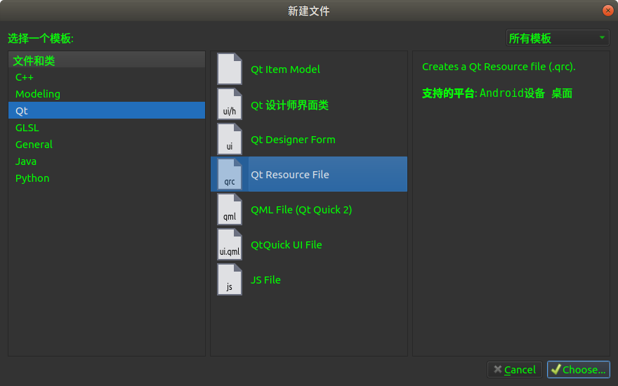
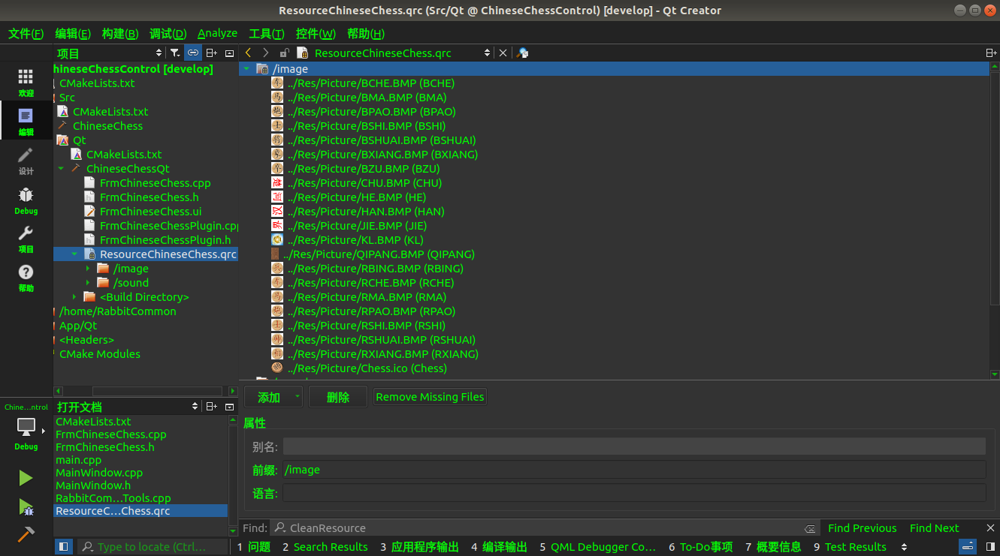

## qt 资源

作 者：康 林(kl222@126.com)

--------------------------------------

qt 资源包括图片资源、翻译资源等。

### 添加资源文件

在项目视图中，在要添加资源的目录上右键。点 "Add New ..."，选择 Qt 资源文件。
**注意**:资源文件名建议使用 $${PROJECT_NAME}_RESOURCE.qrc ; 如下图:

### 添加资源

在刚才建立的资源文件上双击，或者使用资源编辑器打开。向里面添加资源。资源文件实际上是一个文件文件，你也可以直接编辑。

### 使用
#### 加入项目

- pro: 把资源文件加到变量 RESOURCES 中

        RESOURCES += $${PROJECT_NAME}_RESOURCE.qrc

- cmake: 把资源文件(.qrc)直接加入到 add_library 或 add_executable 中

#### 初始化资源

如果要使用库中的资源，则需要在程序开始的时候，用 Q_INIT_RESOURCE 初始化库中的资源，在程序结束时，用 Q_CLEANUP_RESOURCE 清理库中的资源。
如果是程序，Qt 会自动调用 Q_INIT_RESOURCE 初始化资源。但如果是库，则需要手工调用 Q_INIT_RESOURCE 初始化资源。
Q_INIT_RESOURCE 参数为资源文件的基本名。

        Q_INIT_RESOURCE(qApp->applicationName() + "_RESOURCE")

#### 访问资源

在代码中，资源可以用 ":/" 象普通文件一样访问。

        QImage image(":/image/man.png");

#### 翻译资源

##### pro

[Translations.pri](https://github.com/KangLin/RabbitCommon/blob/master/pri/Translations.pri)

使用：
把此文件包含进入工程文件中(.pro)

        TRANSLATIONS_DIR =
        TRANSLATIONS_NAME = 
        include(../pri/Translations.pri) 

在代码中加载翻译资源

        Q_INIT_RESOURCE(${TRANSLATIONS_NAME}); //初始化资源
        QTranslator translator;
        translator.load(CRabbitCommonGlobalDir::Instance()->GetDirTranslations()
                   + "/" + qApp->applicationName() + "_" + QLocale::system().name() + ".qm");
        qApp->installTranslator(&translator);

debug 翻译资源做为资源文件嵌入程序

其它系统发行模式下，做为文件放在程序的安装目录 Translations 目录下  
程序的安装目录：

        AppRoot 
          |- bin
          |    |- App.exe
          |- lib
          |      
          |- translations
              |- ${TRANSLATIONS_NAME}_zh_CN.qm
              |- ${TRANSLATIONS_NAME}_zh_TW.qm

Android 翻译安装目录:

        assets
          |- translations
              |- ${TRANSLATIONS_NAME}_zh_CN.qm
              |- ${TRANSLATIONS_NAME}_zh_TW.qm

源码目录：

        SourceRoot 
          |- App
          |   |- Resource
          |         |-Translations
          |               |- ${TRANSLATIONS_NAME}_zh_CN.ts
          |               |- ${TRANSLATIONS_NAME}_zh_TW.ts
          |- pri
          |      |- Translations.pri
          |      |- lrelease.pri
          |- Src
              |- Resource
                   |-Translations
                         |- ${TRANSLATIONS_NAME}_zh_CN.ts
                         |- ${TRANSLATIONS_NAME}_zh_TW.ts

##### cmake

[Translations.cmake](https://github.com/KangLin/RabbitCommon/blob/master/cmake/Translations.cmake)

GENERATED_QT_TRANSLATIONS 函数：生成 qt 翻译
+ 功能：
  - 生成或更新翻译源文件(.ts)
  - 生成翻译文件(.qm)
  - 生成翻译资源文件(.qrc)，并把资源文件设置到变量 TRANSLATIONS_RESOURCE_FILES 中
  - 安装翻译文件(.qm)到安装目录
+ 参数：
  - SOURCES: 要理新的源文件。默认使用变量 SOURCES_FILES 和 SOURCE_UI_FILES 之中的源文件。
  - NAME: 生成的翻译源文件(.ts)文件名前缀，默认值 ${PROJECT_NAME}。**注意**：翻译资源名为此名字加上前缀 translations_
  - TSDIR: 翻译源文件(.ts)存放的目录，默认值：${CMAKE_CURRENT_SOURCE_DIR}/Resource/Translations
  - UPDATE: 是否更新翻译源文件(.ts)
+ 输出值：
  - TRANSLATIONS_RESOURCE_FILES: 生成的资源文件(.qrc)。
    如果需要使用翻译资源文件，则把它加入到add_executable 或 add_library 中。
+ 使用：
  - 在 CMakeLists.txt加入包含此文件

        include(Translations.cmake)
  
  - 调用 GENERATED_QT_TRANSLATIONS 函数
    + [必选] 设置 SOURCES 参数为要更新的源文件
    + [可选] 设置 NAME 参数为翻译源文件(.ts)文件名的前缀，默认值是目标名 ${PROJECT_NAME}。**注意**：翻译资源名为此名字加上前缀 translations_ 。
    + [可选] 设置 TSDIR 参数为翻译源文件(.ts)生成的目录。默认值是 ${CMAKE_CURRENT_SOURCE_DIR}/Resource/Translations
    + [可选] 设置 UPDATE 参数，是否更翻译源文件(.ts)
  - 如果要使用翻译资源文件，
    则把输出值 ${TRANSLATIONS_RESOURCE_FILES} 加入到 add_executable 或 add_library 中。

        add_executable(${PROJECT_NAME} ${TRANSLATIONS_RESOURCE_FILES})

    在C++代码 main 中加入下列代码初始化翻译资源：

        Q_INIT_RESOURCE(translations_${PROJECT_NAME}); 

  - 如果不需要把翻译放入到资源文件中。在代码中从文件系统加载翻译。详见后面的程序的安装目录。
        
        QTranslator translator;
        translator.load(RabbitCommon::CDir::Instance()->GetDirTranslations()
                   + "/" + qApp->applicationName() + "_" + QLocale::system().name() + ".qm");
        qApp->installTranslator(&translator);

  - 增加目标依赖（可选，默认会自动执行）： 

        add_dependencies(${TRANSLATIONS_NAME} translations_${TRANSLATIONS_NAME})

  - 在源码 main 函数中加入下列代码。
    + 初始化翻译资源。如果是 DEBUG，需要加入宏定义 _DEBUG . 必须使用 -DCMAKE_BUILD_TYPE=Debug

        // 如果使用了翻译资源文件，则必须加上此步，初始化翻译资源
        // 资源文件名为 translations_ 加上 “设置的 NAME”
        Q_INIT_RESOURCE(translations_${PROJECT_NAME});

    + 安装翻译

        // 安装翻译
        QTranslator translator;
        translator.load(RabbitCommon::CDir::Instance()->GetDirTranslations()
                   + "/" + qApp->applicationName() + "_" + QLocale::system().name() + ".qm");
        qApp->installTranslator(&translator);

  - 完整的例子：
    + CMakeLists.txt
  
        include(${CMAKE_SOURCE_DIR}/cmake/Translations.cmake)
        GENERATED_QT_TRANSLATIONS(UPDATE
                SOURCES ${SOURCE_FILES} ${SOURCE_UI_FILES})
        # 把翻译文件加入到资源文件中
        if("Debug" STREQUAL CMAKE_BUILD_TYPE)
            LIST(APPEND QRC_FILE ${TRANSLATIONS_RESOURCE_FILES})
        endif()
        add_executable(${PROJECT_NAME} ${QRC_FILE})
        # 增加依赖（可选）
        add_dependencies(${PROJECT_NAME} translations_${PROJECT_NAME})

    + 源码文件(main.c)

        // 如果使用了翻译资源文件，则必须加上此步，初始化翻译资源
        // 资源文件名为 translations_ 加上 “设置的 NAME”
        #ifdef _DEBUG
            Q_INIT_RESOURCE(translations_${PROJECT_NAME});
        #endif 
        // 安装翻译对象
        QTranslator translator;
        translator.load(RabbitCommon::CDir::Instance()->GetDirTranslations()
                   + "/" + qApp->applicationName() + "_" + QLocale::system().name() + ".qm");
        qApp->installTranslator(&translator);

debug 翻译资源做为资源文件嵌入程序

android 翻译资源放在 assets 中

        Android:
          assets                                      GetDirApplicationInstallRoot()  (Only read)
            |- translations                           GetDirTranslations()
            |        |- ${TRANSLATIONS_NAME}_zh_CN.ts
            |        |- ${TRANSLATIONS_NAME}_zh_TW.ts
 
其它系统发行模式下，做为文件放在程序的安装目录 Translations 目录下
程序的安装目录：

        AppRoot |
                |- bin
                |   |- App.exe
                |- lib
                |
                |- translations
                      |- ${TRANSLATIONS_NAME}_zh_CN.qm
                      |- ${TRANSLATIONS_NAME}_zh_TW.qm

 源码目录：

        SourceRoot |
                   |- App
                   |   |- Resource
                   |        |-Translations
                   |             |- ${TRANSLATIONS_NAME}_zh_CN.ts
                   |             |- ${TRANSLATIONS_NAME}_zh_TW.ts
                   |- cmake
                   |   |- Translations.cmake
                   |- Src
                       |- Resource
                           |-Translations
                                 |- ${TRANSLATIONS_NAME}_zh_CN.ts
                                 |- ${TRANSLATIONS_NAME}_zh_TW.ts

