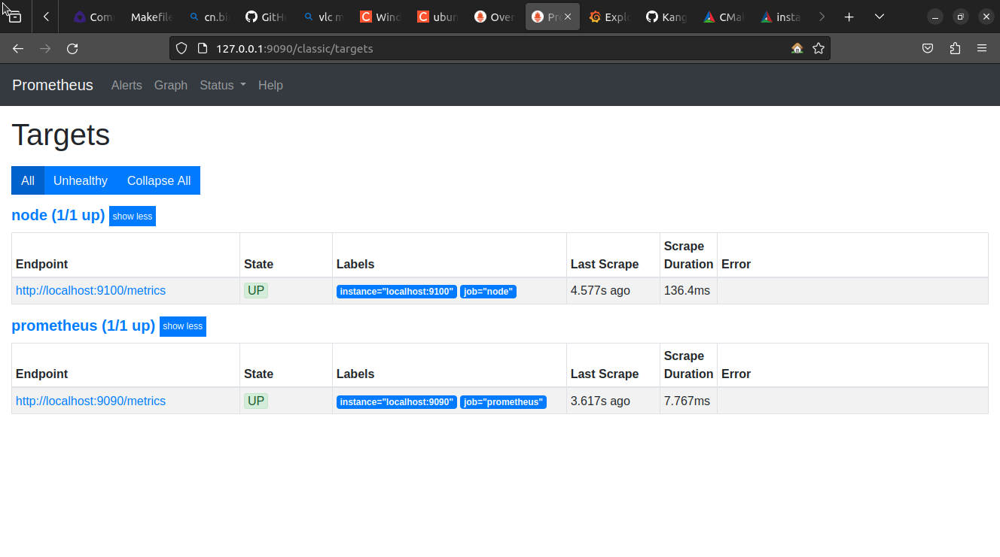

## prometheus

### [Prometheus 介绍](https://prometheus.io/docs/introduction/overview/)

[Prometheus](https://github.com/prometheus/prometheus) 
是一款基于时序数据库的开源监控告警系统，非常适合Kubernetes集群的监控。
Prometheus 的基本原理是通过 HTTP 协议周期性抓取被监控组件的状态，
任意组件只要提供对应的 HTTP 接口就可以接入监控。
不需要任何SDK或者其他的集成过程。这样做非常适合做虚拟化环境监控系统，
比如 VM、Docker、Kubernetes 等。输出被监控组件信息的 HTTP 接口被叫做 exporter 。
目前互联网公司常用的组件大部分都有 exporter 可以直接使用，
比如 Varnish、Haproxy、Nginx、MySQL、Linux 系统信息(包括磁盘、内存、CPU、网络等等)。

Promethus 有以下特点：

- 支持多维[数据模型](https://prometheus.io/docs/concepts/data_model/)：由度量名和键值对组成的时间序列数据
- 内置时间序列数据库 TSDB
- 支持 PromQL 查询语言，可以完成非常复杂的查询和分析，对图表展示和告警非常有意义
- 不依赖分布式存储；单服务器节点是自治的
- 支持 HTTP 的上拉(Pull)方式采集时间序列数据
- 支持 PushGateway 采集瞬时任务的数据
- 支持服务发现和静态配置两种方式发现目标
- 支持多种绘图和仪表板模式。支持接入 Grafana


### 什么是指标？

指标是数字测量。术语时间序列是指随时间变化的记录。用户想要测量的内容因应用程序而异。
对于 Web 服务器，它可能是请求时间;对于数据库，它可以是活动连接数或活动查询数，等等。

指标在理解应用程序以某种方式工作的原因方面发挥着重要作用。
假设您正在运行一个 Web 应用程序，并发现它很慢。
要了解您的应用程序正在发生什么情况，您将需要一些信息。
例如，当请求数较高时，应用程序可能会变慢。
如果您有请求计数指标，则可以确定原因并增加处理负载的服务器数量。

### Prometheus 架构


- Prometheus 服务（Prometheus Server）
    主要负责时间序列数据的采集和存储，提供 PromQL 查询语言的支持。包含了三个组件：
  - Retrieval（提取）: 获取监控数据
  - TSDB: 时间序列数据库(Time Series Database)，
        我们可以简单的理解为一个优化后用来处理时间序列数据的软件，并且数据中的数组是由时间进行索引的。
        具备以下特点：
    - 大部分时间都是顺序写入操作，很少涉及修改数据
    - 删除操作都是删除一段时间的数据，而不涉及到删除无规律数据
    - 读操作一般都是升序或者降序
  - HTTP Server: 为告警和出图提供查询接口
- 指标采集
  - Exporters: Prometheus 的一类数据采集组件的总称。
    它负责从目标处搜集数据，并将其转化为 Prometheus 支持的格式。
    与传统的数据采集组件不同的是，它并不向中央服务器发送数据，
    而是等待 Prometheus 服务主动前来抓取(pull)
  - 推送网关(Pushgateway): 支持临时性 Job 主动推送(push)指标的中间网关。
    Prometheus 服务定时从推送网关抓取(pull)数据。
- 服务发现
  - Kubernetes_sd: 支持从 Kubernetes 中自动发现服务和采集信息。
  - file_sd: 通过配置文件来实现服务的自动发现
- 告警(Alerts)管理

  通过相关的告警配置，对触发阈值的告警通过页面展示、短信和邮件通知的方式告知运维人员。

- 图形化展示(Data visualization and export)

  通过 PromQL 语句查询指标信息，并在页面展示。
  虽然 Prometheus 自带 UI 界面，但是大部分都是使用 Grafana 出图。
  另外第三方也可以通过 API 接口来获取监控指标。

### Prometheus 安装

- 源码库: https://github.com/prometheus/prometheus
- Ubuntu 22.04
  - 安装

        sudo apt install prometheus

  - 启动

        sudo systemctl start prometheus

  - 停止

        sudo systemctl stop prometheus

  - 查看：在浏览器中打开 http://127.0.0.1:9090 。在 Status -> Targets：


### Prometheus 配置
- 配置文件：/etc/prometheus/prometheus.yml

        sudo vim /etc/prometheus/prometheus.yml

### 示例

配置一个节点导出者：

- 安装：

        sudo apt install prometheus-node-exporter

- 启动：

        sudo systemctl start prometheus-node-exporter

- 查看：

        sudo systemctl status prometheus-mode-exporter

- 在 Prometheus 中配置节点导出者：

        sudo vim /etc/prometheus/prometheus.yml

查看是否有下列内容（默认会配置）。如果没有，则加上：

```
  - job_name: node
    # If prometheus-node-exporter is installed, grab stats about the local
    # machine by default.
    static_configs:
      - targets: ['localhost:9100']
```

- 查看：在浏览器中打开 http://127.0.0.1:9090 。在 Status -> Targets：



